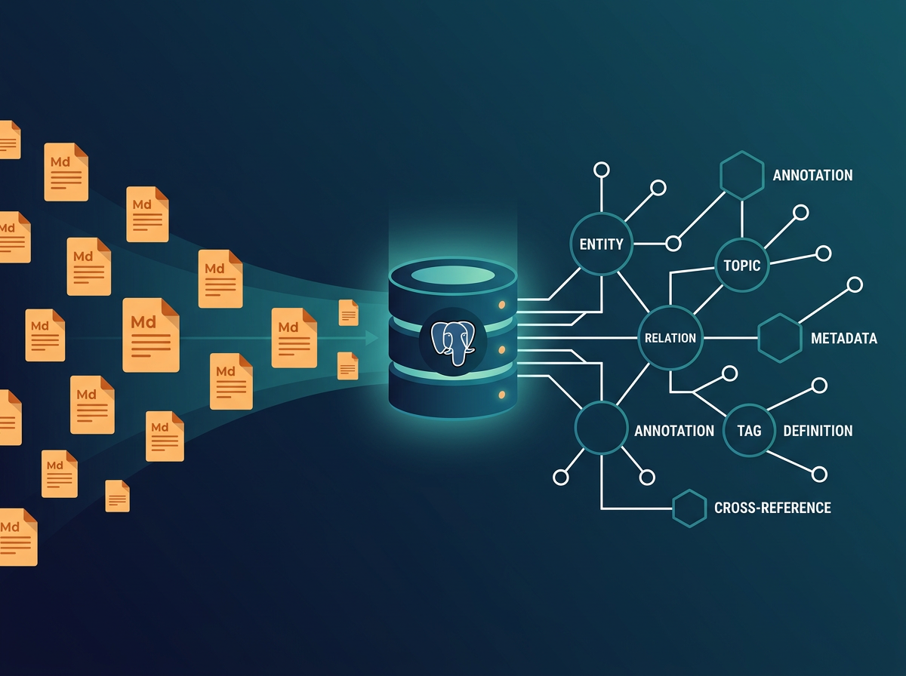

<p align="center">
  
</p>

# LLM Wiki + PostgreSQL: Scaling AI-Maintained Knowledge Bases Beyond the 200-Page Limit

> **Status**: Theoretical architecture — not yet tested in production. Published to share with the community and invite feedback.

## Table of Contents

- [Background](#background)
- [The Original: Karpathy's LLM Wiki](#the-original-karpathys-llm-wiki)
- [The Limit: What Breaks at Scale](#the-limit-what-breaks-at-scale)
- [The Insight: Separate Content from Structure](#the-insight-separate-content-from-structure)
- [The Solution: PostgreSQL as the Wiki's Backbone](#the-solution-postgresql-as-the-wikis-backbone)
- [Complete Architecture](#complete-architecture)
- [The Pipeline Step by Step](#the-pipeline-step-by-step)
- [Operations in Detail](#operations-in-detail)
- [The Key Separation: Intelligence vs Display](#the-key-separation-intelligence-vs-display)
- [PostgreSQL Schema](#postgresql-schema)
- [What This Enables](#what-this-enables)
- [Honest Limitations](#honest-limitations)
- [Status and Next Steps](#status-and-next-steps)
- [Credits and References](#credits-and-references)

---

## Background

I've been using Claude Code daily for months to organize my professional knowledge. My workflow is simple: I take heavy documents — client reports, meeting transcriptions, technical specs — and I convert them into structured markdown files that Claude can work with efficiently.

Over time, I built a skill called **[Distill](https://github.com/romaricvivien65/distill-skill)** to automate this process. Distill takes a raw document (DOCX, PDF, scan) and extracts its substance into clean markdown files: under 800 lines each, one theme per subfolder, zero redundancy, navigable index, full traceability back to the source. The principle: distill once, work with lightweight markdown forever.

This local workflow works remarkably well. Claude reads the markdown files, understands the content, makes connections, and helps me reason about complex projects. The knowledge compounds — each new document enriches the existing base.

Then I wanted to take this further. I wanted to set up a **centralized knowledge system on a VPS** — a place where multiple people could contribute documents and benefit from a shared, AI-maintained knowledge base. While researching how to architect this, I discovered Andrej Karpathy's **LLM Wiki** pattern.

It was exactly what I was doing — but formalized into a clear, elegant methodology.

I studied it. I tested it. I loved it. And then I hit the wall.

---

## The Original: Karpathy's LLM Wiki

In April 2026, Andrej Karpathy published a [GitHub Gist](https://gist.github.com/karpathy/442a6bf555914893e9891c11519de94f) describing a pattern for building personal knowledge bases using LLMs.

The core idea: instead of querying raw documents with each request (like RAG), the LLM **incrementally builds and maintains a persistent wiki** — a structured, interlinked collection of markdown files that sits between you and the raw sources.

### Three Layers

```
raw/                    # Immutable source documents
wiki/                   # LLM-generated markdown pages
CLAUDE.md               # Schema: rules and conventions for the LLM
```

### Three Operations

- **Ingest**: Drop a new source → the LLM reads it, creates summary pages, updates entity and concept pages, maintains cross-references. A single source might touch 10-15 wiki pages.
- **Query**: Ask a question → the LLM searches the wiki index, reads relevant pages, synthesizes an answer with citations.
- **Lint**: Periodic health check → detect contradictions, stale claims, orphan pages, missing concepts, broken cross-references.

### Why It Works

As Karpathy puts it:

> *"The wiki is a persistent, compounding artifact. The cross-references are already there. The contradictions have already been flagged. The synthesis already reflects everything you've read."*

The knowledge is compiled once and kept current — not re-derived on every query. This is fundamentally different from RAG, where each query starts from scratch.

### Wiki Structure

```
wiki/
├── index.md              # Content catalog — the LLM reads this first
├── log.md                # Chronological record of operations
├── overview.md           # High-level synthesis
├── concepts/             # One page per concept
├── entities/             # One page per entity (person, org, place)
├── sources/              # One summary per ingested source
└── comparisons/          # Side-by-side analyses
```

Each page has YAML frontmatter with metadata:

```yaml
---
title: Page Title
type: concept | entity | source-summary | comparison
sources:
  - raw/papers/filename.md
related:
  - "[[related-concept]]"
confidence: high | medium | low
created: 2026-04-15
updated: 2026-04-15
---
```

**It's elegant. It's simple. And it works.** But only up to a point.

---

## The Limit: What Breaks at Scale

The [Starmorph guide](https://blog.starmorph.com/blog/karpathy-llm-wiki-knowledge-base-guide) to Karpathy's LLM Wiki states it clearly:

> *"Practical degradation starts around 200K-300K tokens. The LLM starts missing connections or producing inconsistent pages."*

Karpathy himself acknowledges this in his original gist:

> *"[The index file] works surprisingly well at moderate scale (~100 sources, ~hundreds of pages) and avoids the need for embedding-based RAG infrastructure."*

**At moderate scale.** Beyond that, the system struggles. Here's why:

### The Index Bottleneck

Every operation starts with Claude reading `index.md`. At 50 pages, this file is compact and navigable. At 300+ pages, it becomes a wall of text. Claude has to parse hundreds of entries to decide which files to read. It misses connections. It forgets entries it read 200 lines ago.

### The Lint Collapse

Lint requires Claude to check consistency **across the entire wiki**. At 300 pages, this means reading most of the wiki into context. The context window fills up. Contradictions slip through. Orphan pages go undetected.

### The Ingest Drift

When ingesting a new document, Claude must know what already exists to avoid duplicates and maintain cross-references. At scale, it can't hold the full picture. It creates pages that overlap with existing ones. The wiki accumulates redundancy — the very thing it was designed to prevent.

### The Telephone Game

The Starmorph guide names another risk:

> *"These systems collapse beyond certain complexity thresholds when neither the agent nor the developer maintains sufficient comprehension of the whole."*

Every time the LLM rewrites or updates a page, there's a small risk of information drift. Over hundreds of updates, these small drifts compound. The raw sources remain immutable — but the wiki layer can slowly diverge from them.

---

## The Insight: Separate Content from Structure

The Starmorph guide contains a crucial observation:

> *"[The LLM Wiki is] essentially a manual, traceable implementation of Graph RAG — each claim links to sources, relationships are explicit, and structure is human-readable, but unlike Graph RAG, it requires no graph database."*

This is the key insight. **The LLM Wiki is already a knowledge graph** — but the graph is encoded in markdown files. The relationships live in `[[wikilinks]]` and YAML frontmatter. The index lives in a flat text file. The metadata lives in scattered page headers.

When Claude can hold the entire wiki in context, this works. The graph is implicit but accessible. When the wiki outgrows the context window, the graph becomes invisible. Claude can't see connections it can't read.

**The solution: extract the graph from the markdown and put it in a real database.**

The markdown pages keep the content — the detailed text that humans read and Claude writes. PostgreSQL holds the structure — the concepts, entities, relationships, confidence scores, and source traceability that Claude needs to navigate.

```
TODAY (Karpathy original):
  The graph lives INSIDE the markdown (frontmatter + wikilinks)
  → Claude must re-read everything to reconstruct it
  → Breaks at ~200 pages

WITH POSTGRESQL:
  The graph lives IN the database (structured tables)
  The content lives IN the database (markdown in TEXT columns)
  → Claude queries the database to navigate
  → The database handles thousands of entries instantly
```

---

## The Solution: PostgreSQL as the Wiki's Backbone

### Why PostgreSQL?

- **Relational by nature**: relationships between concepts, entities, and sources are literally what relational databases do
- **Full-text search built in**: `tsvector` and `tsquery` provide search in any language, no external tool needed
- **TEXT columns**: store unlimited markdown content alongside structured metadata
- **Battle-tested**: 28 years old, used by Instagram, Spotify, Apple, NASA
- **Free and open source**: runs on any VPS, no licensing costs
- **pgvector extension**: when you're ready for semantic search, it's one extension away

### Why Not a Vector Database?

The LLM Wiki pattern is built on **explicit, traceable relationships** — not fuzzy similarity scores. The relationships are typed ("works for", "contradicts", "depends on"), directional, and linked to specific sources.

A vector database would add semantic search (useful for queries), but it wouldn't solve the structural problems: navigation, lint, contradiction detection, relationship tracking. PostgreSQL solves all of these **and** can add vector search later via pgvector.

### The Core Idea

At every ingestion, Claude performs a **dual write**:

1. Writes the markdown content into a `pages` table (the detailed text)
2. Writes the structural metadata into `relations`, `sources`, and other tables (the graph)

For navigation and operations, Claude queries the database first. For content generation, Claude reads the markdown from the database. **One source of truth, two complementary views: content and structure.**

---

## Complete Architecture

```
┌──────────────────────────────────────────────────────────┐
│                         VPS                               │
│                                                           │
│  ┌─────────────┐    ┌──────────────┐    ┌─────────────┐  │
│  │   Claude     │    │  PostgreSQL  │    │  Web Server  │  │
│  │   Code       │───▶│              │◀───│  (PHP/Python)│  │
│  │              │    │  All wiki    │    │              │  │
│  │  Intelligence│    │  content +   │    │  Display +   │  │
│  │  - distill   │    │  structure   │    │  search +    │  │
│  │  - ingest    │    │              │    │  navigation  │  │
│  │  - query     │    │              │    │              │  │
│  │  - lint      │    │              │    │              │  │
│  └─────────────┘    └──────────────┘    └─────────────┘  │
│         │                  ▲                    │          │
│         │                  │                    │          │
│         ▼                  │                    ▼          │
│  ┌─────────────┐           │           ┌──────────────┐   │
│  │   raw/      │           │           │   Browser    │   │
│  │   (files)   │           │           │   (client)   │   │
│  └─────────────┘           │           └──────────────┘   │
│         ▲                  │                               │
│         │                  │                               │
│  ┌─────────────┐           │                               │
│  │   inbox/    │───────────┘                               │
│  │  (uploads)  │  /distill converts to markdown            │
│  └─────────────┘  then Claude ingests into PostgreSQL      │
│                                                           │
└──────────────────────────────────────────────────────────┘
```

### Three Components, Three Roles

| Component | Role | When it runs | Cost |
|-----------|------|-------------|------|
| **Claude Code** | Intelligence — understands documents, creates connections, writes knowledge | Only when ingesting, querying complex questions, or linting | API tokens |
| **PostgreSQL** | Storage — holds all content and structure | Always running (background service) | Free |
| **Web Server** | Display — serves pages, search, graph to the browser | Always running | Free |

---

## The Pipeline Step by Step

### Step 1 — Document Arrives

A client uploads a file through the web interface. It lands in `inbox/`.

```
Client uploads: "Annual-Report-2025.pdf"
                        ↓
                     inbox/
```

### Step 2 — Distill (Pre-processing)

The **[Distill](https://github.com/romaricvivien65/distill-skill)** skill converts the raw document into clean markdown. This is a critical pre-processing step that Karpathy's original pattern doesn't include.

Why it matters: a 30-page DOCX consumes 5-10x more tokens than equivalent markdown. Distill extracts the substance once, producing files under 800 lines each, one theme per file, with full source traceability.

```
inbox/Annual-Report-2025.pdf
         ↓
      /distill
         ↓
raw/annual-report-2025/
   ├── 01_executive_summary.md       (120 lines)
   ├── 02_financial_results.md       (180 lines)
   ├── 03_ongoing_projects.md        (200 lines)
   ├── 04_outlook_2026.md            (150 lines)
   ├── _sources.md                   (traceability)
   └── 00_index.md                   (navigable map)
```

The `raw/` directory is **immutable**. These files are never modified after creation. They are the ground truth — the safety net against information drift.

### Step 3 — CLAUDE.md (The Schema)

Before Claude processes anything, it reads the schema file. This file defines:

- How the wiki is structured (page types, naming conventions)
- What to do during ingestion (which tables to populate, what relations to create)
- How to handle contradictions (flag them, don't silently overwrite)
- Quality standards (confidence scoring, source traceability)

The schema is co-designed with each client. A law firm's wiki has different conventions than an NGO's.

### Step 4 — Ingestion (Claude Writes to PostgreSQL)

Claude reads the distilled markdown files and writes **everything** into PostgreSQL:

```sql
-- Create a new page
INSERT INTO pages (wiki_id, title, slug, type, content, confidence)
VALUES (1, 'Aminata Sy', 'aminata-sy', 'entity',
'# Aminata Sy

Chief Financial Officer since January 2025.
Appointed following the departure of...

## Key Decisions
- Led the Q3 budget restructuring
- Initiated the partnership with BAD

## Sources
- Annual Report 2025, Section 1
', 'high');

-- Create relationships
INSERT INTO relations (wiki_id, source_id, target_id, relation_type)
VALUES
  (1, 42, 15, 'works_for'),      -- Aminata Sy → The Company
  (1, 42, 8, 'related_to'),       -- Aminata Sy → Cash Flow
  (1, 42, 31, 'mentioned_in');    -- Aminata Sy → Annual Report 2025

-- Record the source
INSERT INTO sources (wiki_id, original_name, raw_path, summary)
VALUES (1, 'Annual Report 2025', 'raw/annual-report-2025/',
        'Company annual report covering financial results, personnel changes, and 2026 outlook.');

-- Link pages to source
INSERT INTO page_sources (page_id, source_id) VALUES (42, 12);

-- Log the operation
INSERT INTO log (wiki_id, operation, details, pages_affected)
VALUES (1, 'ingest', 'Annual Report 2025 — 4 pages created, 3 updated', 7);
```

One document. Multiple pages created. Relationships established. Sources tracked. Everything in one place.

### Step 5 — The Client Asks a Question

The web server handles simple lookups directly (no Claude needed):

```sql
-- Client types "Aminata Sy" in the search bar
SELECT title, type, LEFT(content, 200) as preview
FROM pages
WHERE wiki_id = 1
  AND (title ILIKE '%aminata sy%' OR content ILIKE '%aminata sy%')
ORDER BY updated_at DESC;
```

For complex questions that require synthesis ("What are the implications of the Q3 restructuring on our West Africa partnerships?"), the web server passes the question to Claude. Claude queries PostgreSQL for relevant pages, reads their content, and generates an answer.

### Step 6 — Lint (Health Check)

Claude runs periodic health checks using SQL queries — no need to read every page:

```sql
-- Orphan pages (no incoming links)
SELECT p.title FROM pages p
LEFT JOIN relations r ON r.target_id = p.id
WHERE r.id IS NULL AND p.wiki_id = 1;

-- Pages not updated in 6 months
SELECT title, updated_at FROM pages
WHERE updated_at < NOW() - INTERVAL '6 months'
  AND wiki_id = 1;

-- Low confidence pages
SELECT title, confidence FROM pages
WHERE confidence = 'low' AND wiki_id = 1;

-- Pages with no source traceability
SELECT p.title FROM pages p
LEFT JOIN page_sources ps ON ps.page_id = p.id
WHERE ps.source_id IS NULL AND p.type != 'comparison'
  AND p.wiki_id = 1;
```

Each query runs in milliseconds. Claude only reads the full content of pages flagged as problematic — not the entire wiki.

---

## Operations in Detail

### Ingest: File-Based vs PostgreSQL

| Step | Original (files) | With PostgreSQL |
|------|------------------|-----------------|
| Read source | Claude reads `raw/` files | Same — `raw/` files stay on disk |
| Check existing pages | Claude reads `index.md` (all entries) | `SELECT title, type FROM pages WHERE wiki_id = 1` |
| Create new page | `Write wiki/entities/aminata-sy.md` | `INSERT INTO pages (title, type, content, ...)` |
| Update existing page | `Edit wiki/concepts/cash-flow.md` | `UPDATE pages SET content = ... WHERE slug = 'cash-flow'` |
| Create cross-references | Add `[[wikilinks]]` in markdown text | `INSERT INTO relations (source_id, target_id, type)` |
| Update index | Append to `wiki/index.md` | Automatic — the `pages` table IS the index |
| Update log | Append to `wiki/log.md` | `INSERT INTO log (operation, details, ...)` |

### Query: File-Based vs PostgreSQL

| Step | Original (files) | With PostgreSQL |
|------|------------------|-----------------|
| Find relevant pages | Read `index.md` (300+ lines) | `SELECT ... WHERE content ILIKE '%keyword%'` |
| Follow connections | Read pages and parse `[[wikilinks]]` | `SELECT ... FROM relations WHERE source_id = X` |
| Read page content | `Read wiki/entities/aminata-sy.md` | `SELECT content FROM pages WHERE id = 42` |
| Synthesize answer | Claude reads and reasons | Same — Claude reads and reasons |

### Lint: File-Based vs PostgreSQL

| Check | Original (files) | With PostgreSQL |
|-------|------------------|-----------------|
| Orphan pages | Read ALL files, check for incoming links | One SQL `LEFT JOIN` query |
| Contradictions | Read ALL files, compare claims | Query `relations` for conflicting types |
| Stale content | Check file modification dates | `WHERE updated_at < threshold` |
| Missing sources | Read frontmatter of every page | `LEFT JOIN page_sources` |
| Missing concepts | Read all text, find unlinked terms | Query pages mentioned in content but absent from `pages` table |

---

## The Key Separation: Intelligence vs Display

This is perhaps the most important architectural insight. The original LLM Wiki uses the LLM for **everything** — navigating, reading, writing, displaying. This is expensive and creates a single point of failure.

With PostgreSQL in the middle, we can separate:

### What Requires Intelligence (Claude Code)

- **Reading a document and understanding it** — extracting entities, concepts, relationships
- **Deciding how to organize information** — what's a new page vs. an update to an existing one
- **Detecting subtle contradictions** — "this report says revenue grew, but last quarter's report said it declined"
- **Writing clear summaries** — synthesizing multiple sources into coherent prose
- **Answering complex questions** — reasoning across multiple pages

**These tasks require an LLM. No web server can do them.**

### What Requires No Intelligence (Web Server)

- **Displaying a page**: read markdown from PostgreSQL → convert to HTML → serve
- **Search bar**: `SELECT WHERE title ILIKE '%keyword%'` → display results
- **Graph visualization**: read `relations` table → render with D3.js
- **File upload**: receive file → save to `inbox/`
- **Navigation**: list pages, filter by type, sort by date
- **Backlinks**: `SELECT FROM relations WHERE target_id = X`

**These tasks are standard CRUD. PHP, Python, or Node.js handles them for free, 24/7.**

### The Cost Implication

```
                           ┌─────────────────────────┐
                           │     CLAUDE CODE          │
                           │     (costs tokens)       │
                           │                          │
                           │  • Ingest new document   │
                           │  • Complex query         │
                           │  • Weekly lint           │
                           │                          │
                           │  ~5% of interactions     │
                           └────────────┬─────────────┘
                                        │
                                        ▼
                           ┌─────────────────────────┐
                           │     POSTGRESQL           │
                           │     (free, always on)    │
                           └────────────┬─────────────┘
                                        │
                                        ▼
                           ┌─────────────────────────┐
                           │     WEB SERVER           │
                           │     (free, always on)    │
                           │                          │
                           │  • Display pages         │
                           │  • Search                │
                           │  • Graph view            │
                           │  • Upload files          │
                           │  • Navigation            │
                           │                          │
                           │  ~95% of interactions    │
                           └─────────────────────────┘
```

If Claude's API limits are reached, **the wiki keeps working**. Users can still browse, search, and navigate. They just can't ingest new documents or ask complex questions until the limit resets. The knowledge base is never unavailable.

---

## PostgreSQL Schema

The complete schema is available in [`schema.sql`](schema.sql).

### Core Tables

```sql
-- Multi-wiki support (one wiki per department, client, or project)
CREATE TABLE wikis (
    id SERIAL PRIMARY KEY,
    name VARCHAR(255) NOT NULL,
    description TEXT,
    created_at TIMESTAMP DEFAULT NOW()
);

-- Every wiki page: content + metadata in one place
CREATE TABLE pages (
    id SERIAL PRIMARY KEY,
    wiki_id INTEGER REFERENCES wikis(id),
    title VARCHAR(255) NOT NULL,
    slug VARCHAR(255) NOT NULL,
    type VARCHAR(50) NOT NULL,  -- 'concept', 'entity', 'source-summary', 'comparison', 'overview'
    content TEXT NOT NULL,       -- Full markdown content
    confidence VARCHAR(20) DEFAULT 'medium',  -- 'high', 'medium', 'low'
    created_at TIMESTAMP DEFAULT NOW(),
    updated_at TIMESTAMP DEFAULT NOW(),
    UNIQUE(wiki_id, slug)
);

-- Typed, directional relationships between pages
CREATE TABLE relations (
    id SERIAL PRIMARY KEY,
    wiki_id INTEGER REFERENCES wikis(id),
    source_id INTEGER REFERENCES pages(id) ON DELETE CASCADE,
    target_id INTEGER REFERENCES pages(id) ON DELETE CASCADE,
    relation_type VARCHAR(100) NOT NULL,
    confidence VARCHAR(20) DEFAULT 'medium',
    created_at TIMESTAMP DEFAULT NOW(),
    UNIQUE(source_id, target_id, relation_type)
);

-- Source document traceability
CREATE TABLE sources (
    id SERIAL PRIMARY KEY,
    wiki_id INTEGER REFERENCES wikis(id),
    original_name VARCHAR(500) NOT NULL,
    raw_path VARCHAR(500),
    ingested_at TIMESTAMP DEFAULT NOW(),
    summary TEXT
);

-- Which pages came from which sources
CREATE TABLE page_sources (
    page_id INTEGER REFERENCES pages(id) ON DELETE CASCADE,
    source_id INTEGER REFERENCES sources(id) ON DELETE CASCADE,
    PRIMARY KEY (page_id, source_id)
);

-- Operation log (replaces log.md)
CREATE TABLE log (
    id SERIAL PRIMARY KEY,
    wiki_id INTEGER REFERENCES wikis(id),
    operation VARCHAR(50) NOT NULL,
    details TEXT,
    pages_affected INTEGER DEFAULT 0,
    created_at TIMESTAMP DEFAULT NOW()
);
```

### Built-in Full-Text Search

PostgreSQL includes a full-text search engine. No external tool needed:

```sql
-- Add search vector column
ALTER TABLE pages ADD COLUMN search_vector tsvector;
CREATE INDEX idx_pages_search ON pages USING gin(search_vector);

-- Auto-update on insert/update
CREATE OR REPLACE FUNCTION update_search_vector() RETURNS trigger AS $$
BEGIN
    NEW.search_vector :=
        setweight(to_tsvector('english', COALESCE(NEW.title, '')), 'A') ||
        setweight(to_tsvector('english', COALESCE(NEW.content, '')), 'B');
    RETURN NEW;
END;
$$ LANGUAGE plpgsql;

CREATE TRIGGER pages_search_update
    BEFORE INSERT OR UPDATE ON pages
    FOR EACH ROW EXECUTE FUNCTION update_search_vector();

-- Search query
SELECT title, ts_rank(search_vector, query) as relevance
FROM pages, to_tsquery('english', 'budget & restructuring') query
WHERE search_vector @@ query
ORDER BY relevance DESC;
```

### Relationship Types

The `relation_type` field supports any relationship. Common types:

| Type | Meaning | Example |
|------|---------|---------|
| `works_for` | Employment | Aminata Sy → The Company |
| `partner_of` | Partnership | BAD → The Company |
| `related_to` | General association | Cash Flow → Budget |
| `contradicts` | Conflicting information | Report 2024 ↔ Report 2025 |
| `supersedes` | Updated information | Q3 Report → Q2 Report |
| `depends_on` | Dependency | Project X → Funding Y |
| `mentioned_in` | Source reference | Aminata Sy → Annual Report |
| `part_of` | Composition | Department → Organization |
| `located_in` | Geography | Office → Senegal |

---

## What This Enables

### 1. Instant Navigation (vs. reading index.md)

```sql
-- "Show me everything related to Senegal"
SELECT p.title, p.type, r.relation_type
FROM relations r
JOIN pages p ON p.id = r.target_id
WHERE r.source_id = (SELECT id FROM pages WHERE slug = 'senegal')
  AND r.wiki_id = 1;
```

### 2. Interactive Graph Visualization

The `relations` table is a ready-made graph dataset. Feed it to D3.js:

```javascript
// Fetch graph data from API
const response = await fetch('/api/graph');
const { nodes, links } = await response.json();

// nodes = SELECT id, title, type FROM pages
// links = SELECT source_id, target_id, relation_type FROM relations

// Render with D3.js force-directed graph
const simulation = d3.forceSimulation(nodes)
    .force("link", d3.forceLink(links).id(d => d.id))
    .force("charge", d3.forceManyBody())
    .force("center", d3.forceCenter(width / 2, height / 2));
```

### 3. Multi-Wiki Support

The `wiki_id` column on every table enables:

- One wiki per department (Finance, Operations, HR)
- One wiki per client
- One wiki per project

```sql
-- Cross-wiki query: find entities that appear in multiple wikis
SELECT p.title, COUNT(DISTINCT p.wiki_id) as wiki_count
FROM pages p
WHERE p.type = 'entity'
GROUP BY p.title
HAVING COUNT(DISTINCT p.wiki_id) > 1;
```

### 4. Backlinks (Automatic)

Every page instantly knows what links TO it:

```sql
-- "What pages reference Aminata Sy?"
SELECT p.title, r.relation_type
FROM relations r
JOIN pages p ON p.id = r.source_id
WHERE r.target_id = 42;  -- Aminata Sy's page id
```

### 5. Future: Semantic Search with pgvector

When ready, add vector embeddings without changing the architecture:

```sql
-- One extension, one column
CREATE EXTENSION vector;
ALTER TABLE pages ADD COLUMN embedding vector(1536);

-- Semantic search
SELECT title, content
FROM pages
ORDER BY embedding <=> $query_embedding
LIMIT 10;
```

This turns the system into a **true hybrid**: structured graph queries for navigation + vector similarity for open-ended questions.

---

## Honest Limitations

### What this architecture solves

| Problem | How PostgreSQL helps |
|---------|---------------------|
| Index bottleneck at 200+ pages | SQL queries replace `index.md` scanning |
| Lint performance collapse | SQL detects structural issues in milliseconds |
| Navigation in large wikis | Typed relationships enable precise traversal |
| Information drift detection | Confidence scores + contradiction tracking |
| Cost (LLM usage) | 95% of reads don't need Claude |

### What this architecture does NOT solve

| Limitation | Why it persists |
|------------|----------------|
| **Context window per query**: Claude can still only read ~200 pages at once | If an answer requires synthesizing 80 pages, Claude still can't hold them all. The ceiling moves from ~200 total to ~200 per question. |
| **Ingestion quality**: the database is only as good as what Claude puts in | If Claude misses a relationship during ingestion, PostgreSQL won't know about it. Lint mitigates this but doesn't eliminate it. |
| **LLM cost**: ingestion and complex queries still require API tokens | PostgreSQL eliminates cost for browsing and simple search, but intelligence work still costs. |
| **Not real-time**: ingestion takes minutes, not milliseconds | This is not a chatbot. It's a knowledge base that gets smarter over time. |

### The Ceiling

Realistic estimate: this architecture comfortably supports **2,000-5,000 wiki pages** per instance. Beyond that, you likely need additional infrastructure (dedicated search engine, multiple specialized agents, partitioned wikis).

For most professional knowledge bases — a company's institutional memory, a project's documentation, a research deep-dive — this is more than enough.

---

## Status and Next Steps

**This is a theoretical architecture.** We have not yet tested it in production.

What we believe to be true:
- Claude Code can execute `psql` commands via its Bash tool ✓
- PostgreSQL can store markdown in TEXT columns ✓
- PostgreSQL's full-text search works on stored markdown ✓
- A web server can read from PostgreSQL and render markdown as HTML ✓
- Each component is proven technology ✓

What we need to test:
- [ ] Claude's consistency in writing SQL during ingestion (does it produce clean, correct queries every time?)
- [ ] The CLAUDE.md schema quality (how detailed must the instructions be?)
- [ ] Performance with 500+ pages (does the architecture scale as expected?)
- [ ] The Distill → Ingest pipeline end-to-end
- [ ] Web interface usability with real users

**When we test it, we'll publish the results.** For now, we're sharing the architecture so the community can evaluate, critique, and potentially implement it.

If you build on this, we'd love to hear about it. Open an issue or reach out.

---

## Credits and References

This work builds directly on:

- **Andrej Karpathy** — [LLM Wiki](https://gist.github.com/karpathy/442a6bf555914893e9891c11519de94f) (April 2026). The original pattern that started it all. Everything here is an extension of his idea.
- **Starmorph** — [Karpathy's LLM Wiki: The Complete Guide](https://blog.starmorph.com/blog/karpathy-llm-wiki-knowledge-base-guide). This guide helped me deeply understand the pattern, its strengths, and its limits. The observation that the LLM Wiki is "essentially a manual, traceable implementation of Graph RAG" was a turning point in my thinking.
- **rohitg00** — LLM Wiki v2 extensions (confidence scoring, memory lifecycle, knowledge graph structure). These ideas align closely with what PostgreSQL can formalize.

Tools used:
- **[Distill](https://github.com/romaricvivien65/distill-skill)** — Document-to-knowledge extraction skill for Claude Code, used in the pre-processing pipeline.
- **Claude Code** by Anthropic — The LLM agent that powers the intelligence layer.
- **PostgreSQL** — The database backbone.

---

## License

MIT — see [LICENSE](LICENSE).

---

*Built with curiosity, tested in theory, published in good faith.*
*— [romaricvivien65](https://github.com/romaricvivien65)*
